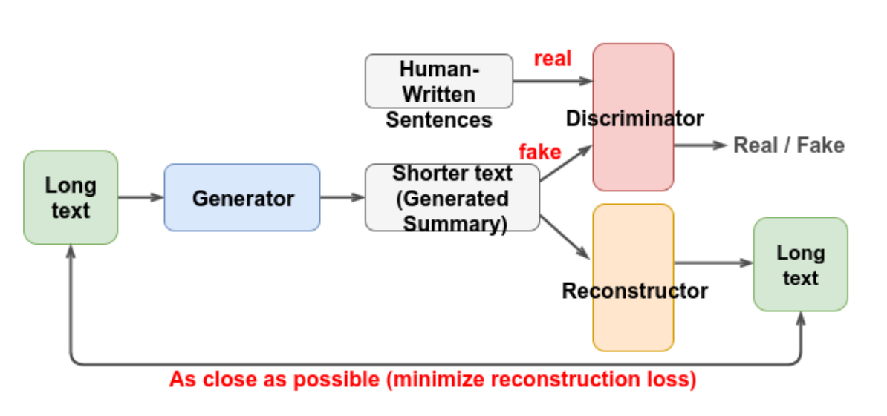

# Brief

## Text summarization using inverse reinforcement learning.

### Guide (Update 2021)

#### Preface

The reason I'm compelled to write this up is that, this is the first codebase where it's not clear on first glance what I'm doing, and I feel that I owe anyone stumbling here an explanation, as the most advanced part of the repository isn't described anywhere, not in the paper, no.

### On Reinforcement Learning (Skip this if you don't care about RL)

Reinforcement learning has always been one of my favorite research fields, ever since I stumbled upon [David Silver's Introduction to Reinforcement Learning][DMRL] and [Sutton and Barto's Intro to Reinforcement Learning][INTRO]. RL is truly beautiful, and it is also the best chance for machines to mimic human's intelligence as RL is used even in the brain (mentioned in Sutton and Barto's). However, the field itself is so math oriented and it's difficult to learn on your own, staring at the equations and hope to get some insights.

#### So what am I doing in this project?

Basically, the goal of the project is one thing. _Text summarization._ To do that I got the _Amazon dataset,_ in which people provide a (longer) comment, often several sentences long, and a (short) description, often in 1 sentence. **An insight is that the comments and descriptions are actually talking about the same thing.** Which is the reason it is chosen as the corpus for training.

#### Why not supervised training?

Text data are not differentiable. Hence RL.

#### How is reinforcement learning used here?

Actually, this project does not use RL directly. It uses **Inverse Reinforcement Learning**, which is a branch of RL. The difference is that in a standard RL problem, the reward is well defined. In this case, there is not an explicitly defined reward so we are also learning the reward.

An easier to understand example would be: in AlphaGo's Go game, the model gets 1 point for winning, and -1 point for losing the game. Every step in the middle before the game terminates gets 0 reward. _All that the model has to do is to learn the **value function** of the game, and it is estimated efficiently with Monte-Carlo Tree search._

In this case, we have some corpus and we assume that the text is generated by some very smart humans, (which can't be said for some comments, but anyways) and we want the model to learn to speak like that. In this case, we can't use a _value function_ to estimate the reward directly. Why? Because **RL is all about maximizing the reward**. And reward is modifiable by the model! The model would simply increase the reward function but may not learn effectively in the process. An analogy of that would be someone addicted to drugs. Happiness is used to guide humans towards success, but drug-addicts are abusing the fact that they can use drugs to control the feeling of happiness. In such a case, being more happy isn't that helpful. _Note: IIRC, the example is used in Sutton and Barto's book, albeit on drug addicted mice, more on that later._

So we could just blindly increase results. We have to only increase the results that's closest to the demonstrated behavior. _In this case, we should say that the description matching the comments should have a higher reward so that agents are incentified to match the comment to the description. In RL terms, we are adjusting rewards such that the right choice appears to be the highest rewarded choice for the agent._

#### How do we do that?

_It appears that while the agent wants to maximize the reward, someone else is reducing the rewards everywhere except where the correct answers lie._ Sounds familiar? It's because it is. It's call **Generative Adversarial Networks**, or **GANs**. And this is what I used to make the IRL works.

#### Summary

1. IRL is different from RL in that in RL reward is well defined.
2. IRL is also a problem of RL, so agents' tasks are to maximize rewards.
3. Rewards can't be blindly increased everywhere. So we use a GAN to solve that.

I hope this is a lot more clear! Cheers! If you are unsure about any wording, feel free to mail me. Also the [course][DMRL] and the [book][INTRO] are so good! Definitely try those if you're interested in learning RL.

### Implementation of the paper [**Learning to Encode Text as Human-Readable Summaries using Generative Adversarial Networks**][paper].

[view paper locally][./paper.pdf]

_please install the requirements using the following command:_

`pip install -r requirements.txt`

This is an implementation of the [paper][paper] using **Deep Q Learning**, a branch of **Reinforcement Learning**.

Here's the brief version:

In `basic_main.py`, the _Generator_, denoted **G**, the Discriminator, denoted **D**, and the Reconstructor, denoted **R**, are all `seq2seq` models. **G+R** is an **Auto Encoder Network**, while **G+D** is trained with **Inverse Reinforcement Learning**. Techniques in use: **Dueling DQN**.

In comparison with `basic_main.py`, `Q.py` uses more advanced techniques, and is a lot more efficient in terms of memory.

An epoch typically takes around _3 days_ to train, on a medium sized dataset with around _half a million_ entries or sentences.

[paper]: http://speech.ee.ntu.edu.tw/~tlkagk/paper/learning-encode-text.pdf
[DMRL]: https://www.youtube.com/playlist?list=PLqYmG7hTraZDM-OYHWgPebj2MfCFzFObQ
[INTRO]: https://www.andrew.cmu.edu/course/10-703/textbook/BartoSutton.pdf
